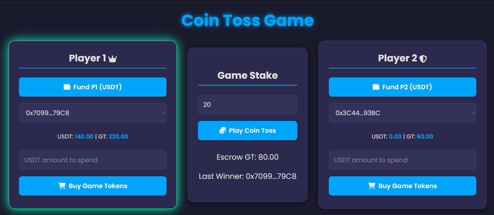
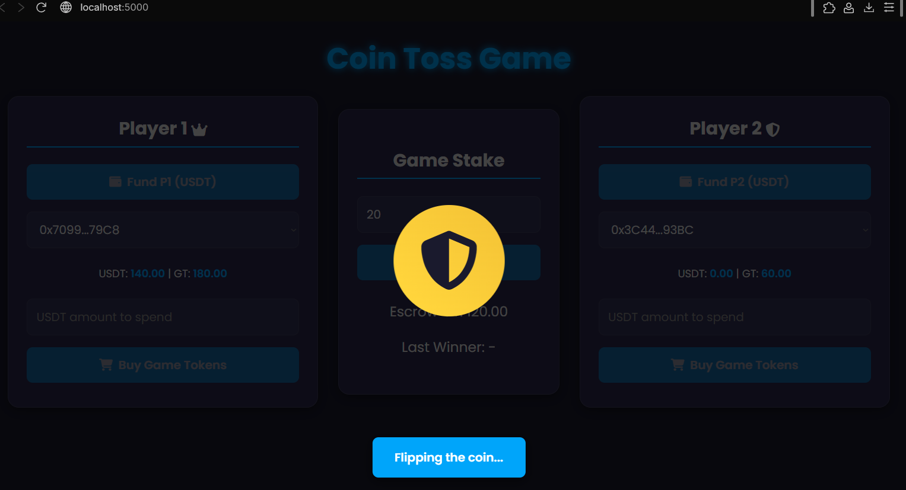
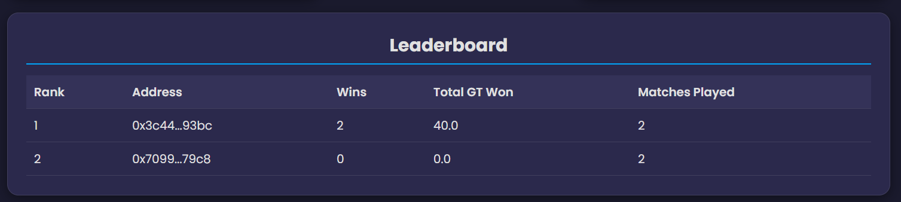

# Coin Toss Game

A decentralized coin toss game built with Solidity smart contracts, a Node.js/Express backend, and a frontend using HTML and JavaScript. Players fund their accounts with USDT, purchase Game Tokens (GT), stake GT in matches, and play a coin toss to win the combined stake. The game uses Ethereum smart contracts for token management and match logic, with a frontend served on port 5000 and a backend on port 3000.




Deployment: [Vercel](https://we-see-sector7-priyanshu-sah.vercel.app)

## Project Structure
- `contracts/`: Solidity smart contracts (`GameToken.sol`, `TokenStore.sol`, `USDT.sol`, `PlayGame.sol`, `Lock.sol`).
- `scripts/`: Deployment script (`deploy.js`).
- `api/`: Backend server (`index.js`).
- `web/`: Frontend files (`index.html`, CSS, and JavaScript).
- `tools/`: A dedicated Node.js service for the leaderboard (`leaderboard.js`).
- `.env`: Environment variables for contract addresses and private keys.

## Prerequisites
- **Node.js**: v16 or later.
- **Hardhat**: For compiling and deploying smart contracts.
- **Ethereum Wallet**: A wallet with testnet ETH (e.g., for Hardhat's local network).
- **Metamask** (optional): For interacting with the frontend if deployed on a testnet.
- **Git**: For cloning the repository (if applicable).

## Run:
To run The Project simply use :
```bash
npm run start
```

## Setup and Installation
Follow these steps to set up and run the project locally. 
```bash
git clone https://github.com/xoTEMPESTox/WeSee-Sector7-Priyanshu_Sah  
cd WeSee-Sector7-Priyanshu_Sah 
npm install 
npm run start 
 
```
Or Manually Below

### 1. Clone the Repository (if applicable)
```bash
git clone https://github.com/xoTEMPESTox/WeSee-Sector7-Priyanshu_Sah
cd WeSee-Sector7-Priyanshu_Sah
```

### 1.5. Instal Node Modules
Install project dependencies,env, including Hardhat and its toolbox Automatically
```bash
npm install
```
To run The Project simply use :
```bash
npm run start
```

### To debug Node Issues try:
To setup env and other packages Manually follow this in case of Errors

### 2. Install Node Modules
Install project dependencies, including Hardhat and its toolbox.

```bash
npm install --save-dev hardhat @nomicfoundation/hardhat-toolbox
npm install express cors ethers dotenv
```

### 3. Initialize Hardhat
Create the necessary directories and initialize a Hardhat project.

```bash
mkdir contracts
mkdir scripts
npx hardhat init
```

When prompted by `npx hardhat init`:
- Choose "Create a JavaScript project."
- Accept defaults or customize as needed.
- Ensure `contracts/` and `scripts/` directories are created.

Move the provided Solidity files (`GameToken.sol`, `TokenStore.sol`, `USDT.sol`, `PlayGame.sol`, `Lock.sol`) to the `contracts/` directory and the deployment script (`deploy.js`) to the `scripts/` directory.

### 4. Configure Environment Variables
Create a `.env` file in the project root with the following variables:
```env
RPC_URL=http://127.0.0.1:8545/  # Hardhat local node
PRIVATE_KEY=<your-operator-private-key>  # Operator wallet private key
PRIVATE_KEY_P1=<player1-private-key>     # Player 1 wallet private key
PRIVATE_KEY_P2=<player2-private-key>     # Player 2 wallet private key
PORT=3000  # Backend port
```

**Note**: Replace `<your-operator-private-key>`, `<player1-private-key>`, and `<player2-private-key>` with actual private keys from your Ethereum wallets (e.g., from Hardhat's local accounts). **Never commit `.env` to version control.**

### 5. Deploy Smart Contracts
Start a Hardhat local node in a terminal:
```bash
npx hardhat node
```

This runs a local Ethereum network on `http://127.0.0.1:8545/` and provides test accounts with ETH. Keep this terminal running.

In a new terminal, deploy the contracts:
```bash
npx hardhat run scripts/deploy.js --network localhost
```

This deploys:
- `USDT.sol`: Mock USDT token.
- `GameToken.sol`: Game Token (GT).
- `TokenStore.sol`: Contract for buying GT with USDT.
- `PlayGame.sol`: Game logic for creating, staking, and settling matches.

The script updates `.env` with deployed contract addresses (`USDT_ADDRESS`, `GAMETOKEN_ADDRESS`, `TOKENSTORE_ADDRESS`, `PLAYGAME_ADDRESS`) and funds Player 1 and Player 2 with 100 USDT each.

### 6. Run the Backend
In a new terminal, start the backend server:
```bash
node api/index.js
```

The backend runs on `http://localhost:3000` (or the port specified in `.env`). It provides API endpoints for:
- `/config`: Returns contract and player addresses.
- `/balance/:address`: Fetches USDT and GT balances.
- `/fund`: Funds a player with USDT.
- `/purchase`: Buys GT with USDT.
- `/match/start`: Creates and stakes a match.
- `/match/play`: Plays the coin toss and commits the result.
- `/escrow-balance`: Checks GT in the `PlayGame` contract.

### 7. Serve the Frontend
Install the `serve` package globally (if not already installed):
```bash
npm install -g serve
```

In another terminal, serve the frontend from the `web/` directory on port 5000:
```bash
npx serve -l 5000 web
```

Place `index.html` (and any associated CSS/JavaScript) in the `web/` directory. The frontend is now accessible at `http://localhost:5000`. The interface displays:
- Player 1 (crown) and Player 2 (shield) with their USDT and GT balances.
- Options to fund accounts, buy GT, and play the coin toss.
- The port (5000) is shown below the "Coin Toss Game" title.

### 8. Verify Setup
- **Frontend**: Open `http://localhost:5000` in a browser. Check that the UI loads, displays "Served on port: 5000," and shows player logos (crown for Player 1, shield for Player 2).
- **Backend**: Test API endpoints, e.g., `curl http://localhost:3000/config` to verify contract addresses.
- **Contracts**: Use Hardhat console (`npx hardhat console --network localhost`) to interact with deployed contracts if needed.

## Running the Application
1. **Hardhat Node**: Keep `npx hardhat node` running in one terminal.
2. **Backend**: Run `node api/index.js` in another terminal (`http://localhost:3000`).
3. **Frontend**: Run `npx serve -l 5000 web` in a third terminal (`http://localhost:5000`).
4. **Interact**:
   - Fund players via the "Fund P1/P2 (USDT)" buttons.
   - Buy GT using the "Buy Game Tokens" buttons.
   - Enter a bet amount (GT) and click "Play Coin Toss" to start a match.
   - The backend randomly selects a winner, and the UI updates balances and the last winner.

## Troubleshooting
- **Port Conflicts**: Ensure ports 3000 (backend) and 5000 (frontend) are free. Use `lsof -i :3000` or `lsof -i :5000` to check and kill conflicting processes.
- **CORS Issues**: If the frontend can’t reach the backend, add a `serve.json` in the `web/` directory:
  ```json
  {
    "port": 5000,
    "proxy": {
      "/api": "http://localhost:3000"
    }
  }
  ```
  Then run `npx serve web`.
- **Nonce Errors**: If `index.js` logs nonce errors, the `runInQueue` function retries automatically. Ensure `RPC_URL` points to the correct Hardhat node.
- **Contract Deployment**: Verify `.env` has correct private keys and `RPC_URL`. Redeploy if addresses are missing (`npx hardhat run scripts/deploy.js --network localhost`).

## Notes
- The `Lock.sol` contract is included but not used in the provided deployment or backend logic. It can be used for time-locked withdrawals if integrated later.
- Ensure JavaScript in `index.html` (not provided) handles API calls to `http://localhost:3000` for functions like `fundPlayer`, `buyGT`, and `playMatch`.
- For production, secure private keys, use a testnet/mainnet, and add proper error handling in the frontend.
