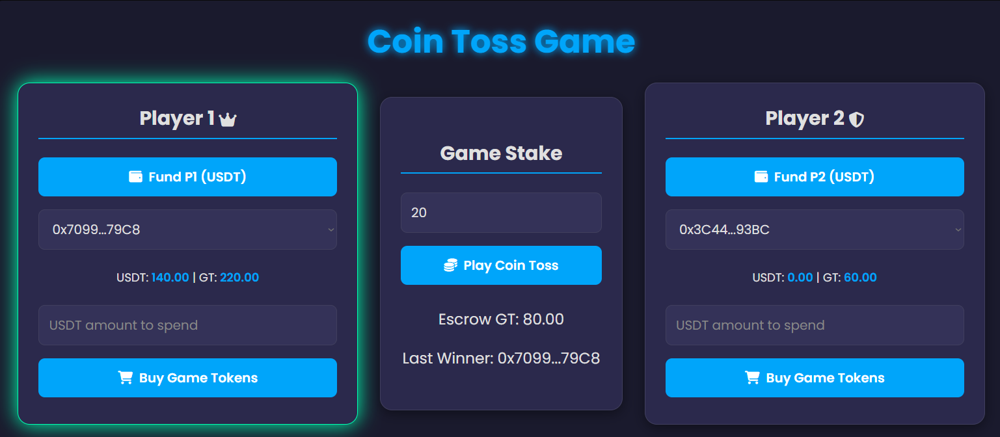
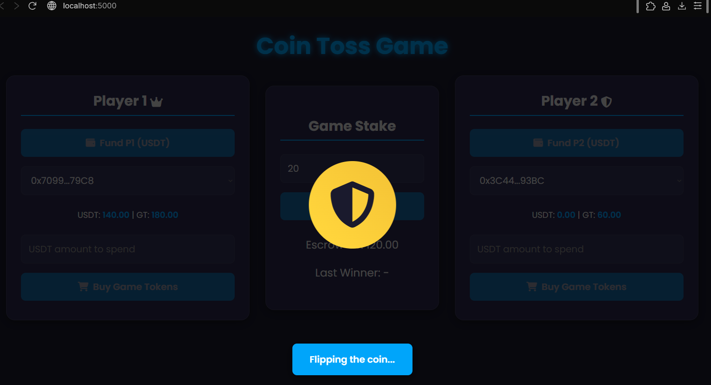
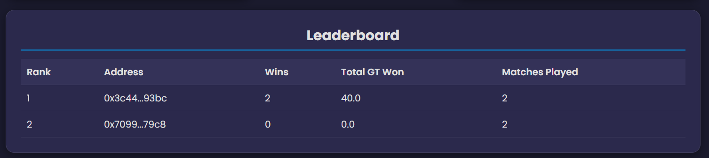

# Coin Toss Game

A decentralized coin toss game built with Solidity smart contracts, a Node.js/Express backend, and a frontend using HTML and JavaScript. Players fund their accounts with USDT, purchase Game Tokens (GT), stake GT in matches, and play a coin toss to win the combined stake. The game uses Ethereum smart contracts for token management and match logic.





## Table of Contents
1. [Project Overview](#project-overview)
2. [Project Structure](#project-structure)
3. [Smart Contracts](#smart-contracts)
4. [Game Flow](#game-flow)
5. [Key Code Snippets](#key-code-snippets)
6. [Live Demo Sequence](#live-demo-sequence)
7. [Prerequisites](#prerequisites)
8. [Setup and Installation](#setup-and-installation)
9. [Running the Application](#running-the-application)
10. [Troubleshooting](#troubleshooting)

## Project Overview

The Coin Toss Game is a decentralized application that allows two players to compete in a coin toss game where each player stakes Game Tokens (GT). The winner takes both stakes, creating an exciting and fair gaming experience powered by blockchain technology.

## Project Structure

- `contracts/`: Solidity smart contracts
  - `GameToken.sol`: Represents the Game Token (GT) used for staking in matches
  - `TokenStore.sol`: Contract for buying GT with USDT
  - `USDT.sol`: Mock USDT token for testing purposes
  - `PlayGame.sol`: Core game logic for creating, staking, and settling matches
  - `Lock.sol`: Time-locked withdrawal contract (not used in current implementation)
- `scripts/`: Deployment scripts
  - `deploy.js`: Script to deploy all smart contracts and configure the environment
- `api/`: Backend server
  - `index.js`: Main backend server file with API endpoints for game operations
- `web/`: Frontend files
  - `index.html`, CSS, JavaScript: The user interface for playing the game
- `tools/`: Utility services
  - `leaderboard.db`: SQLite database for tracking player statistics
  - `leaderboard.js`: Node.js service for managing and serving leaderboard data
- `.env`: Environment variables for contract addresses and private keys

## Smart Contracts

### Game Flow Overview

1. Players fund their accounts with USDT
2. Players buy Game Tokens (GT) using the TokenStore contract
3. Players create a match in PlayGame with a stake amount
4. Both players approve and stake GT to the match
5. The game randomly selects a winner, who receives both stakes

### Key Contract: `PlayGame.sol`

```solidity
// PlayGame.sol - Core game logic for creating, staking, and settling matches
contract PlayGame is Ownable, ReentrancyGuard {
    IERC20 public gameToken;
    address public operator;

    enum MatchStatus { NONE, CREATED, STAKED, SETTLED, REFUNDED }

    struct Match {
        address p1;
        address p2;
        uint256 amountStake; // clearly differentiated from function/event parameters
        MatchStatus status;
        uint256 startTime;
    }

    mapping(bytes32 => Match) public matches;
    mapping(bytes32 => mapping(address => bool)) public hasStaked;

    event MatchCreated(bytes32 indexed matchId, address p1, address p2, uint256 amountStake);
    event PlayerStaked(bytes32 indexed matchId, address player, uint256 amountStake);
    event MatchSettled(bytes32 indexed matchId, address winner, uint256 payout);
    event MatchRefunded(bytes32 indexed matchId);

    constructor(address _gameToken, address _operator) Ownable(msg.sender) {
        gameToken = IERC20(_gameToken);
        operator = _operator;
    }

    function createMatch(bytes32 matchId, address p1, address p2, uint256 matchStake) external onlyOwner {
        require(matches[matchId].status == MatchStatus.NONE, "Match exists");
        matches[matchId] = Match(p1, p2, matchStake, MatchStatus.CREATED, 0);
        emit MatchCreated(matchId, p1, p2, matchStake);
    }

    function stake(bytes32 matchId) external nonReentrant {
        Match storage m = matches[matchId];
        require(m.status == MatchStatus.CREATED || m.status == MatchStatus.STAKED, "Invalid status");
        require(msg.sender == m.p1 || msg.sender == m.p2, "Not a player");
        require(!hasStaked[matchId][msg.sender], "Already staked");

        require(gameToken.transferFrom(msg.sender, address(this), m.amountStake), "GT transfer failed");
        hasStaked[matchId][msg.sender] = true;

        if (hasStaked[matchId][m.p1] && hasStaked[matchId][m.p2]) {
            m.status = MatchStatus.STAKED;
            m.startTime = block.timestamp;
        }
        emit PlayerStaked(matchId, msg.sender, m.amountStake);
    }

    function commitResult(bytes32 matchId, address winner) external nonReentrant {
        Match storage m = matches[matchId];
        require(msg.sender == operator, "Not operator");
        require(m.status == MatchStatus.STAKED, "Not ready");
        require(winner == m.p1 || winner == m.p2, "Invalid winner");

        uint256 payout = m.amountStake * 2;
        require(gameToken.transfer(winner, payout), "GT payout failed");

        m.status = MatchStatus.SETTLED;
        emit MatchSettled(matchId, winner, payout);
    }

    function refund(bytes32 matchId) external nonReentrant {
        Match storage m = matches[matchId];
        require(m.status == MatchStatus.CREATED || m.status == MatchStatus.STAKED, "Not refundable");
        require(block.timestamp > m.startTime + 1 days, "Too early");

        if (hasStaked[matchId][m.p1]) {
            gameToken.transfer(m.p1, m.amountStake);
        }
        if (hasStaked[matchId][m.p2]) {
            gameToken.transfer(m.p2, m.amountStake);
        }
        m.status = MatchStatus.REFUNDED;
        emit MatchRefunded(matchId);
    }
}
```

## Game Flow

The Coin Toss Game follows this flow:

1. **Funding**: Players receive USDT from the backend
2. **Token Purchase**: Players exchange USDT for GT using the TokenStore contract
3. **Match Creation**: The operator creates a match with a stake amount in the PlayGame contract
4. **Staking**: Both players approve and transfer their GT to the match
5. **Coin Toss**: The backend randomly selects a winner
6. **Payout**: The winning player receives both stakes

## Key Code Snippets

### Backend: Match Creation & Staking

```javascript
// api/index.js - Match creation endpoint
app.post('/match/start', async (req, res) => {
  // Create match by operator
  await sendTx(operator, () =>
    playGame.connect(operator).createMatch(matchBytes, player1.address, player2.address, stakeAmt)
  );

  // Player 1 approve + stake
  await runInQueue(player1, async (startNonce) => {
    let nonce = startNonce;
    const a = await gt.connect(player1).approve(process.env.PLAYGAME_ADDRESS, stakeAmt, { nonce });
    await a.wait();
    nonce++;
    const s = await playGame.connect(player1).stake(matchBytes, { nonce });
    return s.wait();
  });

  // Player 2 approve + stake
  await runInQueue(player2, async (startNonce) => {
    let nonce = startNonce;
    const a = await gt.connect(player2).approve(process.env.PLAYGAME_ADDRESS, stakeAmt, { nonce });
    await a.wait();
    nonce++;
    const s = await playGame.connect(player2).stake(matchBytes, { nonce });
    return s.wait();
  });

  res.json({ success: true, matchId });
});
```

### Frontend: Coin Toss Animation

```javascript
// web/index.js - Coin toss animation and winner display
async function playMatch() {
  const stake = document.getElementById('betAmt').value;
  if (!stake || Number(stake) <= 0) return setStatus('Please select a stake greater than 0.', 3000, 'error');

  // ... match setup code ...

  // Start coin animation
  setStatus('Flipping the coin...');
  coinOverlay.style.display = 'flex';
  coin.style.transform = 'rotateY(0deg)'; // Reset coin
  coin.classList.add('flipping');

  // Wait for flip animation before getting result
  await new Promise(resolve => setTimeout(resolve, 3500));

  const playRes = await fetch(`${API}/match/play`, {
    method: 'POST',
    headers: { 'Content-Type': 'application/json' },
    body: JSON.stringify({ matchId })
  });
  const playData = await playRes.json();

  // ... display winner ...
}
```

## Live Demo Sequence

The live demo shows the complete user journey:

1. **Game Setup**: The backend starts with a Hardhat local node, deploys contracts, and initializes player accounts
2. **Player Funding**: Players receive USDT from the backend
3. **Token Purchase**: Players buy GT using their USDT balance
4. **Match Creation**: A match is created with a stake amount
5. **Staking**: Both players approve and transfer their GT to the match
6. **Coin Toss**: The coin toss animation plays, and a winner is randomly selected
7. **Payout**: The winning player receives both stakes

Watch the video demo: [Demo Video](video/Demo.mkv)

## Prerequisites

- **Node.js**: v16 or later.
- **Hardhat**: For compiling and deploying smart contracts.
- **Ethereum Wallet**: A wallet with testnet ETH (e.g., for Hardhat's local network).
- **Metamask** (optional): For interacting with the frontend if deployed on a testnet.

## Setup and Installation

### Quick Start

```bash
git clone https://github.com/xoTEMPESTox/WeSee-Sector7-Priyanshu_Sah
cd WeSee-Sector7-Priyanshu_Sah
npm install
npm run start
```

### Manual Setup

1. **Clone the Repository**

   ```bash
   git clone https://github.com/xoTEMPESTox/WeSee-Sector7-Priyanshu_Sah
   cd WeSee-Sector7-Priyanshu_Sah
   ```

2. **Install Dependencies**

   ```bash
   npm install --save-dev hardhat @nomicfoundation/hardhat-toolbox
   npm install express cors ethers dotenv sqlite3 serve
   ```

3. **Initialize Hardhat**

   ```bash
   mkdir contracts scripts
   npx hardhat init
   ```

   - Choose "Create a JavaScript project."
   - Move the provided Solidity files to the `contracts/` directory and deployment script to `scripts/`.

4. **Configure Environment Variables**

   Create a `.env` file in the project root:

   ```env
   RPC_URL=http://127.0.0.1:8545/  # Hardhat local node
   PRIVATE_KEY=<your-operator-private-key>  # Operator wallet private key
   PRIVATE_KEY_P1=<player1-private-key>     # Player 1 wallet private key
   PRIVATE_KEY_P2=<player2-private-key>     # Player 2 wallet private key
   PORT=3000  # Backend port
   LEADERBOARD_PORT=4000  # Leaderboard service port
   FRONTEND_PORT=5000  # Frontend port
   ```

5. **Deploy Smart Contracts**

   ```bash
   npx hardhat node
   npx hardhat run scripts/deploy.js --network localhost
   ```

6. **Run the Backend and Leaderboard Service**

   ```bash
   node api/index.js
   node tools/leaderboard.js
   ```

7. **Serve the Frontend**

   ```bash
   npm install -g serve
   npx serve -l 5000 web
   ```

8. **Access the Game**

   Open your browser and go to `http://localhost:5000`

## Running the Application

1. Start a Hardhat local node:
   ```bash
   npx hardhat node
   ```
2. Deploy contracts:
   ```bash
   npx hardhat run scripts/deploy.js --network localhost
   ```
3. Run backend server:
   ```bash
   node api/index.js
   ```
4. Start the leaderboard service:
   ```bash
   node tools/leaderboard.js
   ```
5. Serve frontend (in a new terminal):
   ```bash
   npx serve -l 5000 web
   ```
6. Access the game at `http://localhost:5000`

## Troubleshooting

- **Port Conflicts**: Ensure ports 3000 (backend), 4000 (leaderboard), and 5000 (frontend) are free.
- **CORS Issues**: If frontend can't reach backend, add a `serve.json` in web/ directory:
  ```json
  {
    "port": 5000,
    "proxy": {
      "/api": "http://localhost:3000"
    }
  }
  ```
- **Nonce Errors**: Ensure `RPC_URL` points to correct Hardhat node.
- **Contract Deployment**: Verify `.env` has correct private keys and addresses.

## Notes

- The `Lock.sol` contract is included but not used in the provided deployment or backend logic. It can be used for time-locked withdrawals if integrated later.
- Ensure JavaScript in `index.html` handles API calls to `http://localhost:3000` for functions like `fundPlayer`, `buyGT`, and `playMatch`.
- For production, secure private keys, use a testnet/mainnet, and add proper error handling.

## License

This project is licensed under the MIT License - see the [LICENSE](LICENSE) file for details.